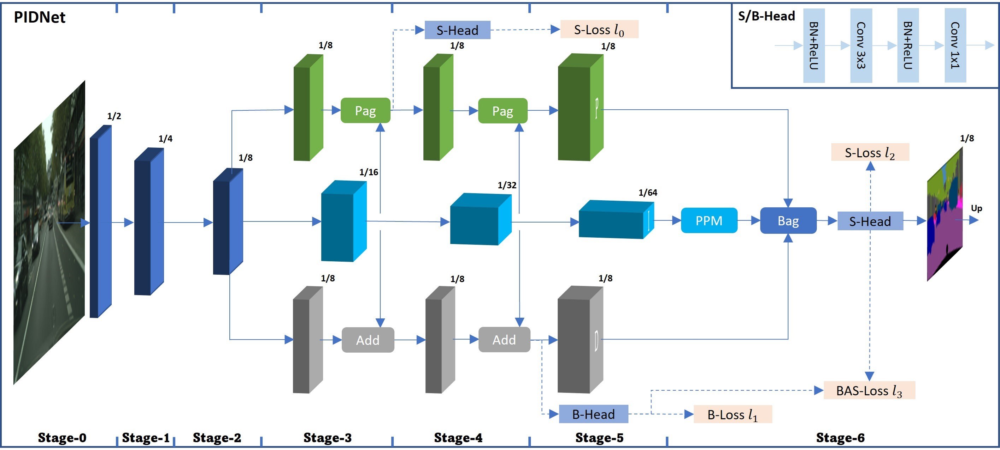

# [PIDNet](https://arxiv.org/pdf/2206.02066.pdf)  [](https://hits.seeyoufarm.com)      <a href="/LICENSE"></a>
<!-- https://hits.seeyoufarm.com/ -->

[](https://paperswithcode.com/sota/real-time-semantic-segmentation-on-camvid?p=pidnet-a-real-time-semantic-segmentation)   [](https://paperswithcode.com/sota/real-time-semantic-segmentation-on-cityscapes?p=pidnet-a-real-time-semantic-segmentation)   [](https://paperswithcode.com/sota/real-time-semantic-segmentation-on-cityscapes-1?p=pidnet-a-real-time-semantic-segmentation)
## PIDNet: A Real-time Semantic Segmentation Network Inspired from PID Controller 


## Project Setup

This project is designed to train PIDNet on a custom dataset, it has custom loss functions so please consider that. The following steps will guide you through setting up the project and preparing your data.

### Requirements

First, ensure you have all the required packages installed. You can do this by installing the packages listed in `requirements.txt`.

```bash
pip install -r requirements.txt
```

### Cloning the Repository

Clone the repository to your local machine using the following command:

```bash
git clone https://github.com/Mahmood-Hussain/PIDNetTensorflow.git
cd PIDNetTensorflow
```

### Configuration File

Create a configuration JSON file (e.g., `config.json`) with the necessary parameters. An example configuration is as follows:

```json
{
    "experiment_name": "my_experiment",
    "resume": false,
    "root": "/path/to/dataset",
    "img_height": 384,
    "img_width": 512,
    "num_classes": 2,
    "mean": [0.44669862, 0.4538911, 0.42983834],
    "std": [0.26438654, 0.256789, 0.26210858],
    "label_map": [0, 0, 255, 1, 1, 1],
    "batch_size": 8,
    "learning_rate": 0.001,
    "epsilon": 1e-7,
    "epochs": 50,
    "model_type": "pidnet",
    "show_model_summary": true
}
```

### Preparing Data

The `KashmirDataset` class in `dataloader.py` expects the dataset to be organized in a specific format. Here's how you should structure your dataset:

```plaintext
dataset_root/
    images/
        train/
            image1.jpg
            image2.jpg
            ...
        val/
            image1.jpg
            image2.jpg
            ...
    labels/
        train/
            image1.png
            image2.png
            ...
        val/
            image1.png
            image2.png
            ...
```

- **Images**: Place your training and validation images in the respective directories (`images/train`, `images/val`).
- **Labels**: Place your corresponding label images in the respective directories (`labels/train`, `labels/val`).

Ensure that the image filenames match their corresponding label filenames.

### Training the Model

To start training the model, run the `train.py` script with the path to your configuration file:

```bash
python train.py --config config.json
```

### Loss Function

This project uses a custom loss function `BasnetLoss`, which is a hybrid loss combining three components:

1. **Sparse Categorical Cross Entropy Loss**: Measures the difference between the ground truth labels and predicted labels.
2. **Structural Similarity Index (SSIM) Loss**: Evaluates the similarity between the ground truth and predicted images.
3. **Intersection over Union (IoU) Loss**: Measures the overlap between the predicted and ground truth labels.

The `BasnetLoss` class is defined in `criterion.py` and incorporates these three components to provide a comprehensive loss calculation.


` Hit star ⭐ if you find this work useful. `

## Credits

The code is heavily imported from:

- **PIDNe Tensorflow**: [PIDNet](https://github.com/hamidriasat/PIDNet)
- **Hamid Ali**: [Hamid Ali](https://keras.io/examples/vision/basnet_segmentation/)
- **PIDNet**: The architecture on which this project is based. [PIDNet](https://arxiv.org/abs/2109.12449)
- **BASNet**: An architecture for salient object detection, whose loss function was adapted for this project. [BASNet](https://arxiv.org/abs/1903.03829)


## Overview
<p align="center">
  </br>
  <span align="center">An overview of the basic architecture of our proposed Proportional-Integral-Derivative Network (PIDNet). </span> 
</p>
P, I and D branches are responsiable for detail preservation, context embedding and boundary detection, respectively.

### Detailed Implementation
<p align="center">
  </br>
  <span align="center">Instantiation of the PIDNet for semantic segmentation. </span> 
</p>
For operation, "OP, N, C" means operation OP with stride of N and the No. output channel is C; Output: output size given input size of 1024; mxRB: m residual basic blocks; 2xRBB: 2 residual bottleneck blocks; OP<sub>1</sub>\OP<sub>2</sub>: OP<sub>1</sub> is used for PIDNet-L while OP<sub>1</sub> is applied in PIDNet-M and PIDNet-S. (m,n,C) are scheduled to be (2,3,32), (2,3,64) and (3,4,64) for PIDNet-S, PIDNet-M and PIDNet-L, respectively.


Licensed under [MIT License](LICENSE)
